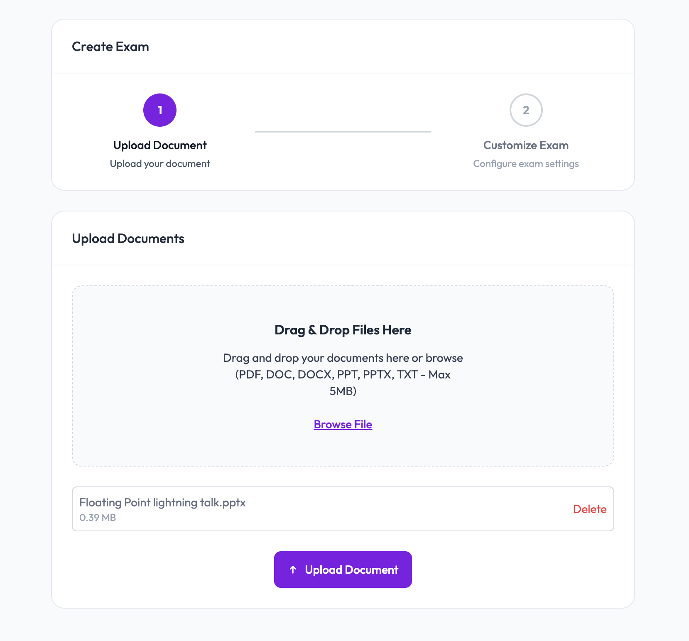
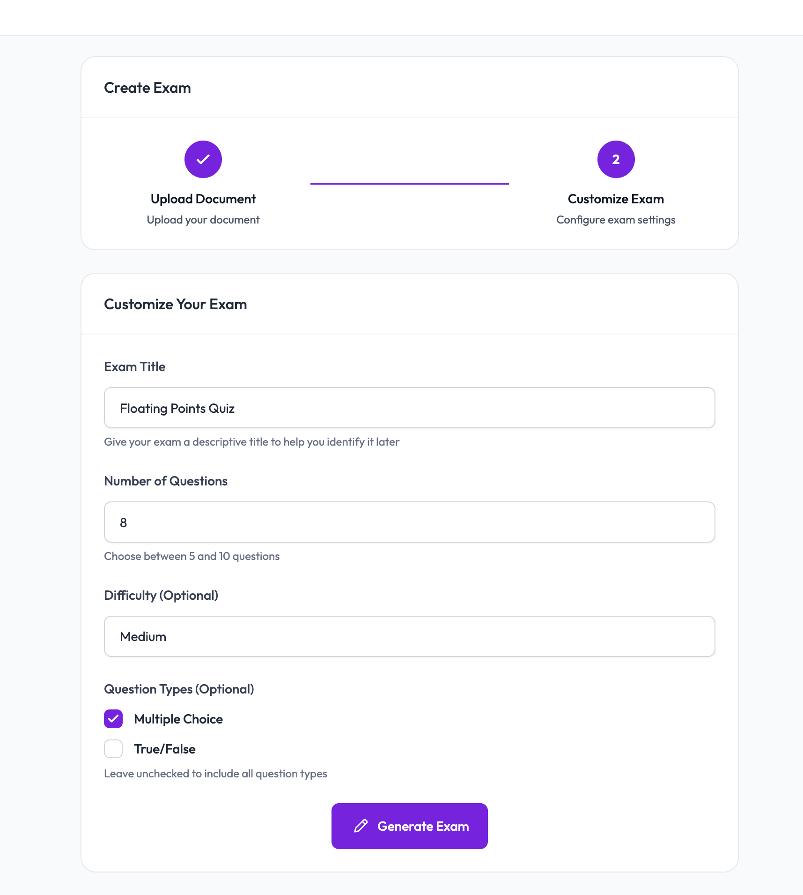
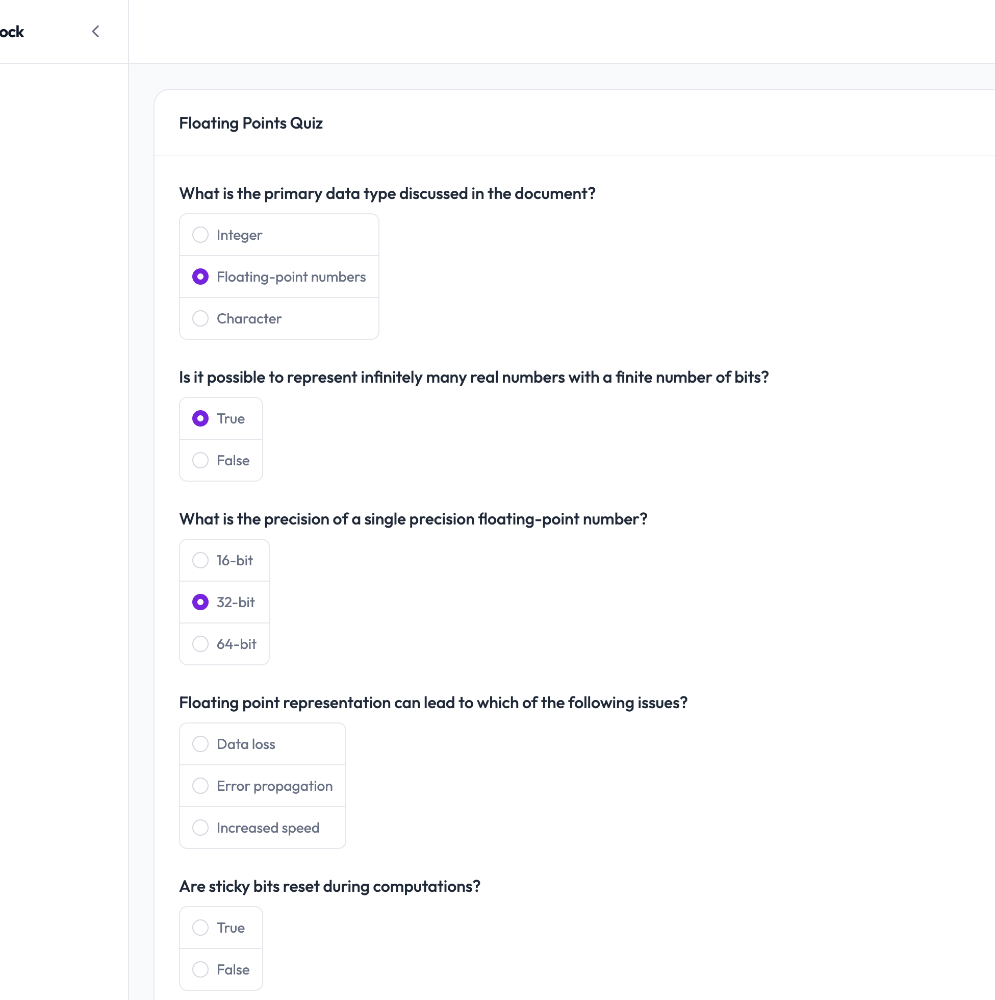
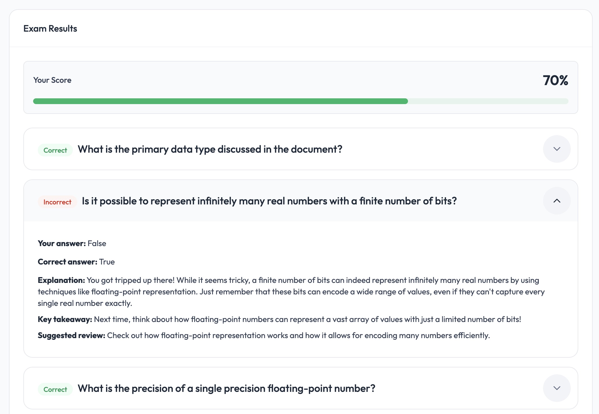
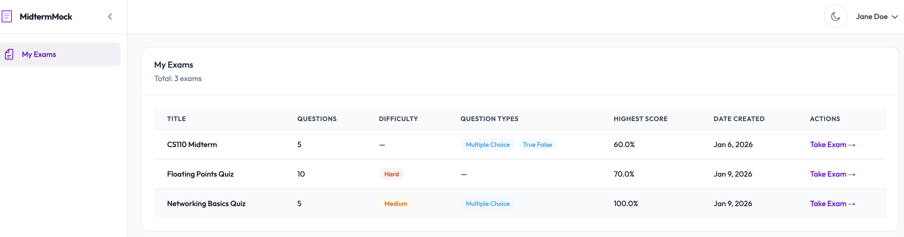

# MidtermMock

### Try it out 🚀
**Live demo:** http://54.70.243.149:5173/

---

## Overview

MidtermMock enables students to **learn by doing** by turning raw course materials into practice exams. Instead of rereading lecture slides, students upload their documents (PDFs, Word docs, PowerPoints, or plain text) and receive AI-generated questions that resemble real exam questions.

Each exam is automatically scored with detailed, context-aware explanations—explained in a way that mirrors how the instructor presented the material. Students can retake exams, review explanations, and track their progress over time.

---

## User Journey


**1. Document Upload**
Upload course materials (PDF, DOCX, PPT, TXT) for processing.
<p align="center">
  
</p>

**2. Exam Configuration**
Configure question count, difficulty, and question types.
<p align="center">
  
</p>

**3. Exam in Progress**
Take the interactive mock exam.
<p align="center">
  
</p>

**4. Results & Explanations**
Automatic scoring with explanations grounded in the original document.
<p align="center">
  
</p>

**5. Progress Tracking and Retakes**
Track your highest score on exams and retake them to improve.
<p align="center">
  
</p>

## Key Features

- Upload documents (PDF, DOCX, PPT, TXT)
- Generate practice exams from uploaded content
- Configurable difficulty and question types
- Automatic scoring with grounded explanations
- Exam retakes and score history
- User authentication

---

## Architecture & Design Decisions ⭐

I chose **simplicity and reliability over maximum scale**, given the project’s scope.

### Decision Matrix

| Problem | Decision | Tradeoff |
|-------|----------|----------|
| Generating questions from user documents | LLM-based generation (GPT-4o-mini via LangChain) | Non-deterministic and costlier. Scoring and validation remain deterministic in code. |
| Grounding explanations in source material | Top-K semantic retrieval over document chunks | Explanations are limited to retrieved context, but remain grounded in lecture content rather than hallucinated knowledge. |
| Long documents causing token-limit failures | Hard-cap document context to 15,000 characters during generation | May omit later content, but keeps latency and cost predictable. |
| Question format consistency | Strict Pydantic validation + prompt constraints | Less flexible, but prevents malformed questions from reaching users. |
| Explanation relevance | pgvector in PostgreSQL instead of a separate vector DB | Simpler deployment and atomic writes; not designed for massive scale. |
| Long-running AI and document-processing tasks | Asynchronous background jobs | Keeps the API responsive during generation and extraction. |
| Development hygiene | Early CI/CD investment | Slower initial setup, but caught critical bugs early. |

---

### Deterministic vs. Non-Deterministic Boundaries

**Deterministic components:**
- Scoring logic (pure Python)
- Question validation (Pydantic models)
- Exam structure (DB constraints + API contracts)

LLMs handle creativity. Code enforces correctness and consistency.

---

### Document Processing

Multiple document formats are supported by **AWS Textract**. Extracted text is chunked, embedded, and stored using **pgvector** in PostgreSQL.

When generating feedback for incorrect answers, the system performs **Top-K semantic retrieval** to fetch the most relevant chunks from the original document, which are determined with **cosine similarity** to the question's embedding. This ensures explanations are grounded in the lecture material itself, not inferred from external knowledge or generic model priors.

---

## Core Design

- **Frontend:** Next.js
- **API:** Custom endpoints extending a FastAPI boilerplate (Python)
- **AI:** OpenAI GPT via LangChain with Pydantic structured output.
  Prompt rules enforce question-type consistency, difficulty semantics, and document-only knowledge.

---

## Core Tech Stack

### Backend
- FastAPI (Python)
- PostgreSQL + pgvector
- LangChain + OpenAI
- AWS Textract

### Frontend
- Next.js (React, TypeScript)
- Tailwind CSS
- TanStack Query

### Infrastructure
- Docker & Docker Compose

---

## Quick Start

### Backend Development Mode

.env is provided (just change the secrets to your own)

```bash
git clone https://github.com/monicasmith463/midterm-mock
cd midterm-mock
```

Then follow the instructions in backend/README.md (they come from the original FastAPI boilerplate)

### Frontend Development Mode

To run the frontend in development mode with hot reload:

```bash
cd frontend
npm install
npm run dev
```

The frontend will be available at `http://localhost:3000` (or the port specified in your Next.js config).

## Project Foundations

This project was bootstrapped using open-source foundations.

- **Infra + Backend:** Based on the FastAPI full-stack boilerplate
  https://github.com/fastapi/full-stack-fastapi-template
  Used as a starting point for authentication, database setup, and project structure.

- **Frontend:** Built using drop-in components from TailAdmin
  https://tailadmin.com
